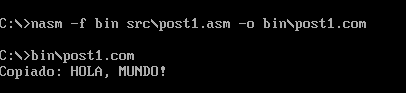
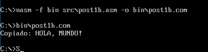
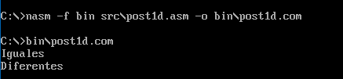

# Laboratorio Unidad 8 - Operaciones con Cadenas (NASM)

## Descripción
Implementación de programas en ensamblador x86 que utilizan instrucciones de procesamiento de cadenas como REP MOVSB, REPNE SCASB y REPE CMPSB para copiar, buscar y comparar datos en memoria.

## Estructura del proyecto
- src/ → código fuente (.asm)
- bin/ → ejecutables (.com)
- capturas/ → evidencias

## Tecnologías
- NASM
- DOSBox

## Evidencias
## 1: Copia de cadena con REP MOVSB

Se implementó la copia de una cadena utilizando REP MOVSB, verificando que el contenido del buffer destino coincide con la cadena original.

## 2: Copia optimizada con REP MOVSW

Se optimizó la copia de la cadena utilizando REP MOVSW para copiar palabras y MOVSB para el byte restante, obteniendo el mismo resultado.

## 3: Búsqueda con REPNE SCASB

Se implementó la búsqueda de un carácter en una cadena utilizando REPNE SCASB, mostrando la posición cuando se encuentra o un mensaje en caso contrario.

## 4: Comparación de cadenas con REPE CMPSB

Se compararon cadenas utilizando REPE CMPSB, identificando correctamente casos de igualdad y diferencia.

